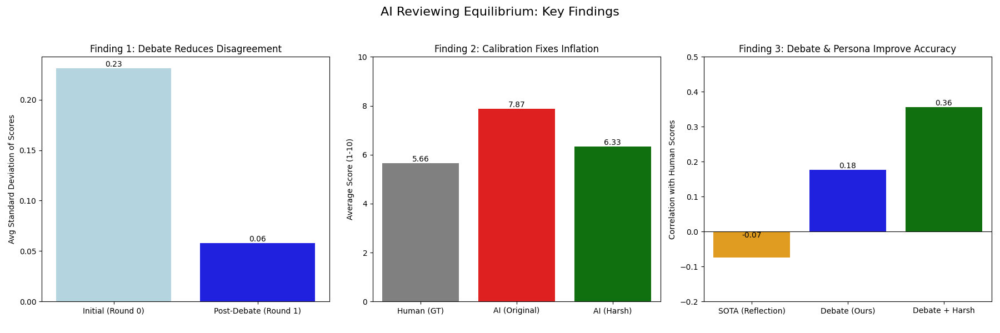

# AI Reviewing Equilibrium

## Project Overview
This research project investigates the dynamics of multi-agent debate in scientific paper reviewing. We tested whether a committee of AI agents (GPT-4o, Claude 3.5 Sonnet, GPT-4o-mini) could reach a better consensus on paper quality than individual models through a process of "Reviewer Equilibrium."

## Key Findings
*   **Convergence**: Agents successfully converged on agreed scores after one round of debate (Variance reduced by ~75%).
*   **Grade Inflation**: AI models systematically overestimated paper quality (Mean ~7.8) compared to human reviewers (Mean ~5.6).
*   **Consensus != Accuracy**: The debate process led to "herding" around inflated scores, actually reducing correlation with human ground truth compared to a single GPT-4o agent.

## File Structure
*   `src/`: Source code for agents, experiment loop, and analysis.
*   `results/`: Experimental data (JSON/CSV) and generated plots.
*   `datasets/`: ICLR paper data (subset).
*   `papers/`: Reference literature.
*   `REPORT.md`: Full research report.
*   `CODE_WALKTHROUGH.md`: Detailed technical guide to the codebase.

## Reproduction
1.  **Environment**:
    ```bash
    uv sync
    source .venv/bin/activate
    ```
2.  **Full Reproduction (One Command)**:
    ```bash
    ./run_all.sh
    ```
    This script runs the entire pipeline: Main Experiment -> Calibration -> Improvement -> SOTA Comparison -> Aggregation.

3.  **Individual Steps**:
    *   `src/experiment.py`: Main debate loop.
    *   `src/experiment_calibrated.py`: Harsh critic test.
    *   `src/analyze_debate.py`: Qualitative analysis.
    *   `src/plot_master_summary.py`: Generate summary figure.

## Testing
To verify the codebase logic (agent parsing, data utils) without making API calls:
```bash
python -m unittest discover tests
```

## Key Visualizations

